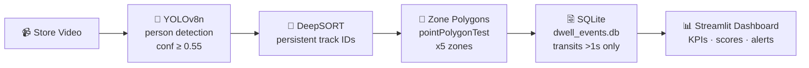

# 🏪 Retail Zone Analytics

> *Turning store CCTV footage into the kind of insight a store manager would normally pay a consultant for — except this one runs on a single Python script and doesn't ask for coffee.*

I built this because retail managers spend a lot of energy *guessing*: which aisle is dead, where the checkout queue is bottlenecking, whether that end-cap display is actually pulling people in. The camera already sees all of it — it just never bothered to tell anyone. So I taught it to.

Retail Zone Analytics watches a store video, tracks each shopper as a persistent ID, figures out which zone they're standing in, measures how long they linger, and pipes everything into a freshly redesigned manager dashboard with KPIs, engagement scores, and automated "hey, you should look at this" alerts.

---

## ✨ What It Does

- **Detects people** in video using YOLOv8n (confidence threshold `0.55`, so the chair in the corner doesn't get counted as a customer).
- **Assigns persistent track IDs** with DeepSORT — Customer #7 stays Customer #7 as they wander the store.
- **Maps each shopper to a store zone** by testing their bounding-box center against 5 hand-drawn zone polygons.
- **Logs dwell events** — who, which zone, when they entered/exited, and for how long — into a SQLite database.
- **Filters out noise** — any "transit" under 1 second is dropped, because brushing past the checkout isn't really *shopping at* the checkout.
- **Visualizes everything** in a Streamlit + Plotly dashboard a non-technical manager can actually read.

### The five zones

`Entrance` · `Checkout Counter` · `Center Aisle` · `Back Aisle` · `Right Aisle`

---

## 🛠️ Tech Stack


| Layer | Tools |
| --- | --- |
| Detection | PyTorch · Ultralytics YOLOv8n |
| Tracking | deep-sort-realtime (DeepSORT) |
| Geometry | OpenCV (`cv2.pointPolygonTest`) |
| Storage | SQLite (`dwell_events.db`) |
| Dashboard | Streamlit · Plotly · pandas |

---

## 🧭 Architecture

From raw pixels to a manager's "aha" moment, the data flows in one direction:



In plain English: **video → detect people → keep their IDs → figure out their zone → record the dwell → show the manager.**

---

## 📊 What the Dashboard Shows

The dashboard (Streamlit + Plotly, with a 30-second data cache so it stays snappy) gives a manager:

- **Headline KPIs** — unique visitors, total zone events, average dwell time, and the busiest zone.
- **Per-zone breakdown** — unique visitors and average dwell time, zone by zone.
- **Zone Engagement Score** — a 0–100 blend of visitor count and dwell time, so you can rank which zones are *actually* pulling people in (not just being walked past).
- **Zone visit frequency** — total entries per zone across the session.
- **Dwell-time breakdown table** — total visits plus avg / max / min dwell, ranked.
- **Per-customer journeys** — the zone-by-zone path each tracked shopper took through the store.
- **Automated manager alerts**, which fire when:
  - a zone's engagement score drops **below 50** ("reposition products or improve signage"),
  - average dwell in a zone is **under 8s** ("customers are passing through without engaging"),
  - a zone records **zero activity** (a dead zone),
  - or the **Checkout Counter** average wait climbs **above 60s** (queue bottleneck).

---

## ▶️ How to Run

It's a two-step show. First you process the video into a database, then you point the dashboard at it.

**Step 1 — Process the video and build the database:**

```bash
pip install -r requirements.txt
python main.py
```

This opens a live preview window with bounding boxes, track IDs, and current-zone labels, while quietly logging dwell events to `dwell_events.db`. Press `q` to stop.

**Step 2 — Launch the manager dashboard:**

```bash
streamlit run dashboard.py
```

Then open the local URL Streamlit prints and enjoy your store, quantified.

---

## 🖼️ Screenshots

> *Dashboard screenshots coming soon* — the freshly redesigned UI deserves a proper photoshoot, and I haven't pointed a camera at it yet.

---

## ⚠️ Limitations & Privacy

A few honest notes, because I'd rather you trust the README than be surprised by it:

- **The zone polygons are camera-specific.** They're hand-drawn pixel coordinates for one particular camera angle, so swapping in a different store view means redrawing the five zones.
- **The video and database paths are hardcoded** (currently Windows paths I set before running). Update them at the top of `main.py` and `dashboard.py` for your own setup — this README is a docs pass, so I'm not touching the code here. Yet.
- **Privacy by design (sort of):** the video is processed locally and only anonymous, ephemeral track IDs ever land in the database — no faces, names, or identities are stored. The footage stays on your machine. As always, deploy people-tracking responsibly and within local regulations.

---

## 👤 About the Author

**Abdullah Mohammed Hazeq** — Computer Science (AI) graduate, Asia Pacific University. Based in Dubai, UAE, and on the hunt for roles in AI automation, data analysis, and AI implementation. I like projects where a model does something a business can actually *use* — this is one of them.

[](https://linkedin.com/in/abdullahmhazeq)
[](https://github.com/KiritoH4Z3)

📧 ahazeq.mena@gmail.com
